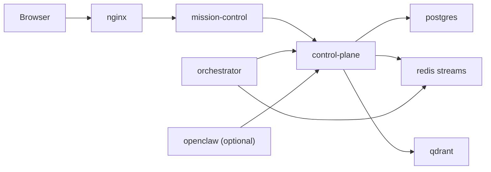

# 🦞 agentStack

Open-source AI team control plane for software work.

## Stack

| Service | Purpose |
|---|---|
| `mission-control` | Primary web UI and thin BFF |
| `control-plane` | Source of truth for workspaces, agents, tasks, runs, and audit events |
| `orchestrator` | Async worker foundation using LangGraph + Redis Streams |
| `postgres` | Source of truth |
| `redis` | Streams/event bus |
| `qdrant` | Semantic memory index |
| `nginx` | Reverse proxy |
| `openclaw` | Optional gateway profile |

## Quickstart

```bash
git clone https://github.com/iolyte/agentStack.git
cd agentStack
./scripts/agentstack install
cp .env.example .env
agentstack start
```

Open [http://localhost](http://localhost).

To enable the optional OpenClaw gateway:

```bash
docker compose --profile gateway up -d openclaw
```

## Architecture



## Notes

- Mission Control owns browser auth and UI only.
- The control-plane owns the `amp` schema.
- The orchestrator is the async execution foundation.
- The desktop app remains in `desktop/`, but it is frozen while the core split lands.
