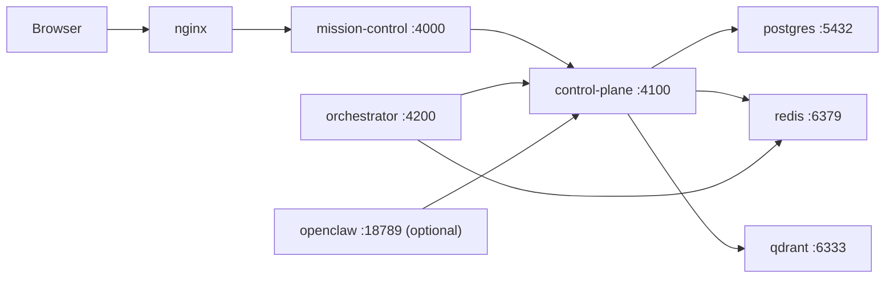

# agentStack — Architecture

## Overview

agentStack is an open-source AI team control plane.

- `mission-control` = UI/BFF
- `control-plane` = source of truth
- `orchestrator` = async execution
- `openclaw` = optional gateway adapter

## Runtime

## Responsibilities

- `mission-control`
  - browser auth/session
  - product UI
  - thin proxy to control-plane
  - ops visibility
- `control-plane`
  - workspaces
  - projects
  - agents
  - tasks
  - messages
  - runs
  - workspace events
- `orchestrator`
  - Redis Streams consumers
  - LangGraph execution foundation
  - future approval/retry/routing flows
- `postgres`
  - source of truth
- `redis`
  - event bus and queue
- `qdrant`
  - semantic retrieval index
- `openclaw`
  - optional chat/voice gateway integration

## Defaults

- Default stack does **not** require `openclaw`
- All containers share `agentstack_net`
- Only `nginx` is intended as the public entrypoint
